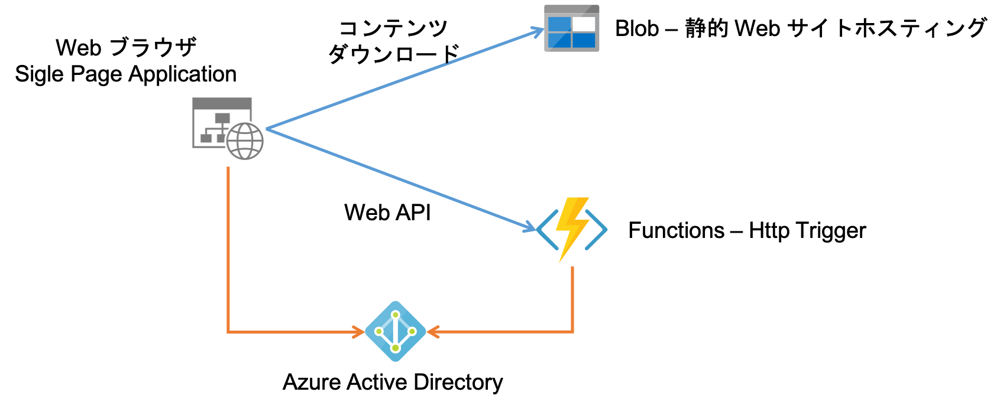
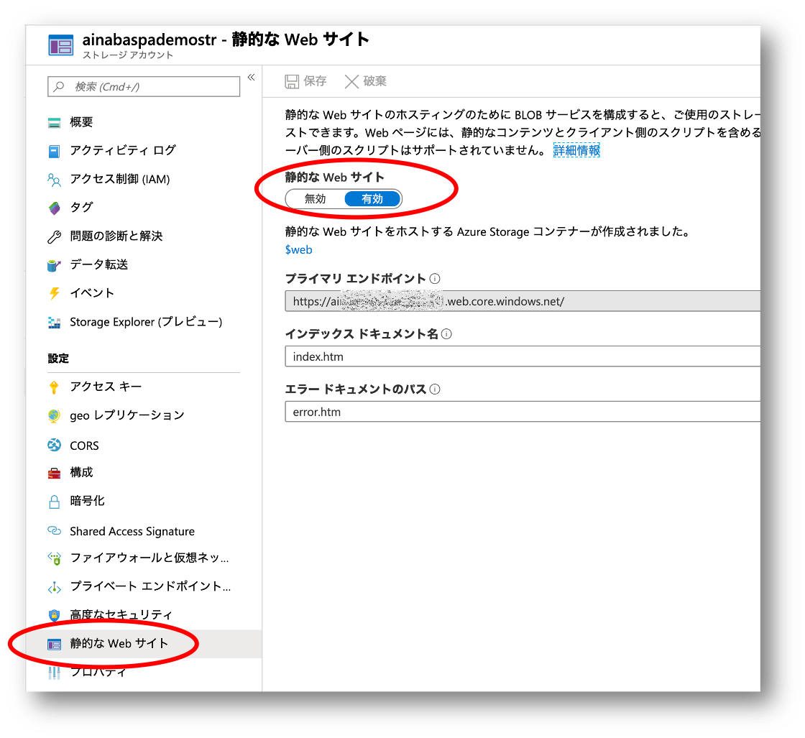
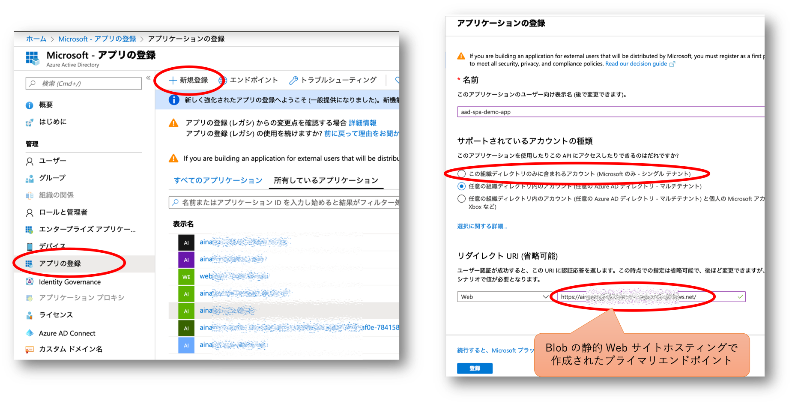
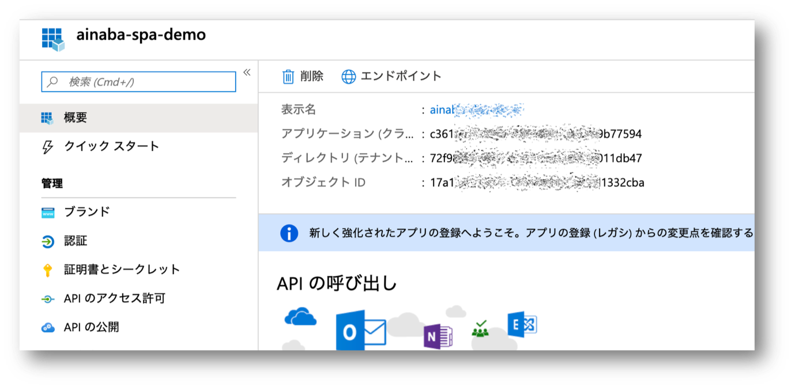
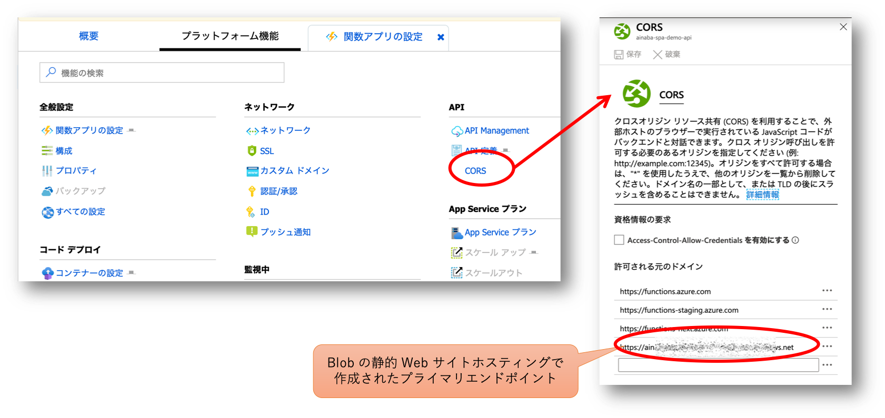
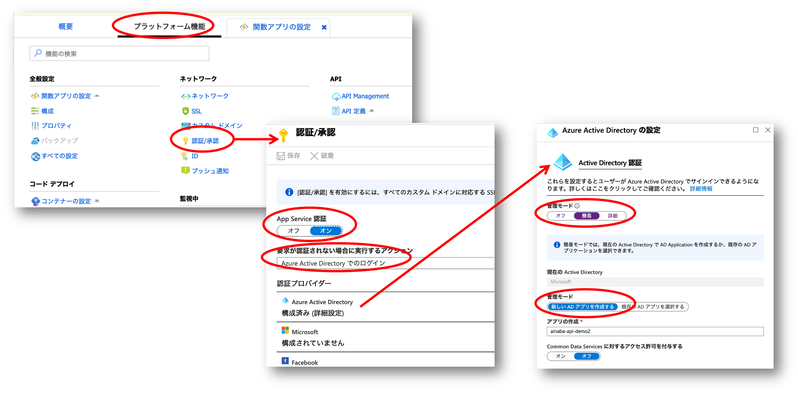
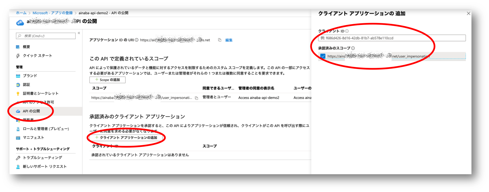
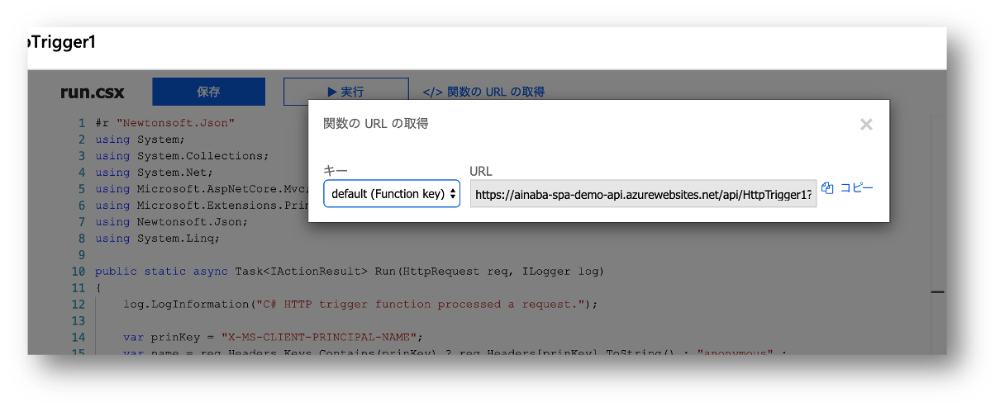
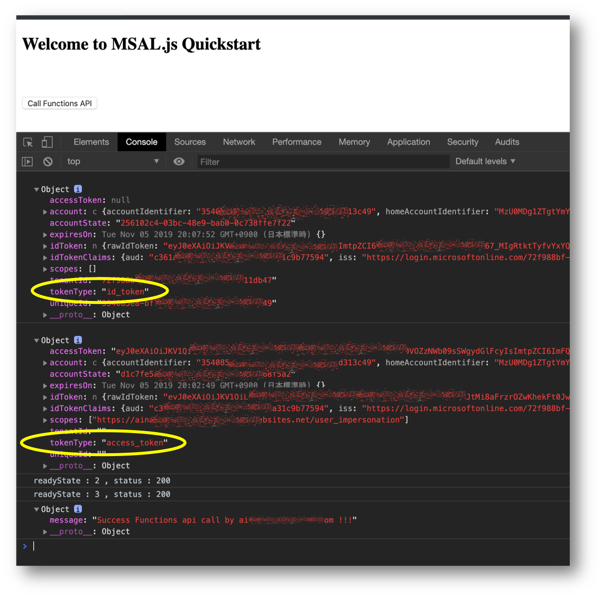

# Azure サーバーレス Web アプリケーション （シンプル版）

本家のドキュメントには
[Azure 上のサーバーレス Web アプリケーションの作成](https://docs.microsoft.com/ja-jp/azure/architecture/reference-architectures/serverless/web-app)
に関する詳細な記載がありますが、
カスタムドメインの適用やセキュリティのために CDN や API Management を使用したアーキテクチャになっており、最小構成としては若干オーバースペックかなというところで、
最もシンプルに実装した場合のサンプルを作成してみました。



[Azure Storage の静的 Web サイト ホスティング](https://docs.microsoft.com/ja-jp/azure/storage/blobs/storage-blob-static-website) 
を使用して提供する SPA ： Sinble Page Web Application が
OAuth 2.0 で策定されている [Implicit Grant Flow](https://docs.microsoft.com/ja-jp/azure/active-directory/develop/v2-oauth2-implicit-grant-flow) を使用して
[Azure Active Directory](https://docs.microsoft.com/ja-jp/azure/active-directory/) にサインイン、
さらに [Azure Functions](https://docs.microsoft.com/ja-jp/azure/azure-functions/) で実装された Web API を呼び出すサンプルになっています。
Implicit Grant Flow の実装部分には
[Microsoft Authentication Library (MSAL) for JS](https://github.com/AzureAD/microsoft-authentication-library-for-js)
を使用しています。

# セットアップ手順

サンプルの実行環境となるプラットフォームとしては以下が必要になります。

- SPA をホストする Storage Account
- Web API を提供する Functions
- 上記２つを表す Azure Active Directory のアプリケーション

これらを準備したのちに、アプリケーションコンテンツを配置していきます。

## SPA の構成

### Azure Storage の作成

Azure Portal の Marketplace から
[Storage Account](https://portal.azure.com/#create/Microsoft.StorageAccount-ARM)
を作成します。
その際に以下のパラメタを入力してください（それ以外は任意）

- パフォーマンス : Standard
- アカウントの種類 : StorageV2
- レプリケーション : ローカル冗長ストレージ（LRS）

### 静的 Web ホスティングの有効化

ストレージアカウントが作成できたら静的 Web ホスティング機能を有効にします。



`$web` という名前の Blob コンテナが作成され、そこに配置された各種のコンテンツ（html/js/css/etc...）が上図の `プライマリエンドポイント` から提供できる様になります。

### Azure AD アプリケーションとして登録

作成した SPA でユーザーのサインインを行うために Azure AD にアプリケーションとして登録します。



- サポートされているアカウントの種類 : この組織ディレクトリのみに含まれるアカウント (シングル テナント)
- リダイレクト URI
    - 種類 ：　Web
    - URI　：　静的 Web サイトホスティングで作成された プライマリエンドポイント



登録が完了すると GUID 形式のアプリケーション ID （クライアントID）が生成されていますので、この値を控えておきます。
同じ画面でアプリケーションが登録された Azure AD テナントの ID も表示されていますので、こちらの値も控えておきます。

## Web API の構成

### Function App の作成

Azure Portal の  Marketplace から 
[Function App](https://portal.azure.com/#create/Microsoft.FunctionApp)
を作成します。以下のオプションを指定してください。

- 公開方法 ： コード
- ランタイムスタック : .NET Core 

### オリジン間リソース共有の有効化

作成した Function App でホストされる Web API をブラウザ上で動作する SPA から呼び出すことになるわけですが、
SPA の提供ドメインと Function App の提供ドメインが異なるため、ブラウザの CORS : Cross Origin Resource Sharing 制限に引っかかってしまいます。
Functon App の プラットフォーム機能の **CORS** 設定画面から、**許可される元のドメイン** として前述の静的 Web ホスティングの `プライマリエンドポイント` を登録してください。




### 認証の有効化

作成した Function は認証が有効になっていないので、このままではアクセスコードを知っていれば誰でもアクセスできてしまします。
プラットフォーム機能として **App Service 認証を有効** にし、認証されていないリクエストは **Azure Active Directory でのログイン** を強制する様に設定します。
Azure Active Directory 認証の構成画面では **簡易モード** を使用して **新しい AD アプリを作成** します



### API アクセスの許可

上記の様に認証を設定すると Function App も Azure AD のアプリケーションとして登録されますので、この API に対するアクセスを SPA に対して許可します。
**承認済みのクライアントアプリケーション** として、静的 Web ホスティングを Azure AD アプリケーションとして登録した際に生成された
GUID 形式のアプリケーション ID （クライアントID）と **承認済みのスコープ** を追加します。
ここでは **user_impersonation** という既定で作成されているスコープのみで大丈夫です。



このスコープを表す URI も後ほど必要になりますので控えておいてください。

## アプリケーションコンテンツの配置

### Web API としての Function 関数の作成

まず Http Trigger を使用する C# スクリプトの関数を作成します。
サンプルコードは [こちら](./api)に配置していますが、App Service 認証によってセットされたリクエストヘッダーからユーザー情報を読み取り、挨拶文を返すだけのシンプルな内容にしてあります。
なお App Service 認証が有効になっていますので、ポータル画面からはテスト実行することができません。

```c#
public static async Task<IActionResult> Run(HttpRequest req, ILogger log)
{
    log.LogInformation("C# HTTP trigger function processed a request.");
    var prinKey = "X-MS-CLIENT-PRINCIPAL-NAME";
    var name = req.Headers.Keys.Contains(prinKey) ? req.Headers[prinKey].ToString() : "anonymous" ;
    return new OkObjectResult(new { Message = $"Success Functions api call by {name} !!!" } );
}
```

関数が作成できたら default の Function Key を含んだ URL をコピーして控えておいてください。



### ユーザーインタフェースとしてのSPA コンテンツの配置

SPA 用のコンテンツは [こちら](./spa) に配置してありますが、設定値を上記で作成した環境に合わせる必要があります。
`param.js` という名前のファイルを作成し、以下の内容をここまで控えた設定値に書き換えてください。
`msalConfig` セクションが認証に使用する情報ですので、静的 Web サイトホスティングを登録した際のアプリケーションの情報を入力します。
`api` セクションが Web API を呼びだす際に使用する情報ですので、Function を作成・登録した際の値を入力します。

``` javascript
const param = {
    msalConfig : {
        auth: {
            clientId: "clientid-of-spa-application",
            authority: "https://login.microsoftonline.com/tenantid-of-azure-ad",
            validateAuthority: true
        },
        cache: {
            cacheLocation: "localStorage",
            storeAuthStateInCookie: false
        }
    },

    login : {
        token_request : {
            scopes: ["openid", "profile", "User.Read"]
        }
    },

    api : {
        token_request : {
            scopes: ["https://functionAppName.azurewebsites.net/user_impersonation"]
        },
        url : "https://functionAppName.azurewebsites.net/api/functionName?code=yourFunctionKey"
    }
}
```

`param.js` ファイルを作成したら [index.htm](./spa/index.htm)および[auth.js](./spa/auth.js) ファイルと共に、
ストレージアカウントの `$web` コンテナにアップロードしてください。

## 動作確認

In Private ブラウズなどの認証キャッシュを持たない状態のブラウザを開きm、Blob のプライマリエンドポイント URL にアクセスしてください。
`index.htm` ドキュメントのロード時に前述の `param.js` に記入した Login 用の Token Request に応じて認証要求を行いますが、
まだ認証情報を持っていないのでポップアップ画面が表示され、ユーザー認証を要求されます。
正しくユーザー認証が成功すると `identity token` が発行されます。
実装は [auth.js](./spa/auth.js) の `signIn()` メソッドを参照してください。

次に Function API を呼び出すボタンを押下すると、`param.js` に記入した api 用の Token Request を使用して Web API へのアクセス認可要求を行います。
このタイミングでは identity token を保有していますので自動的に `access token` が取得できます。
ここで取得した Access Token を `Authorization` HTTP Header にセットすることで、Function API の呼び出しが可能になります。
実装は [auth.js](./spa/auth.js) の `callApi()` メソッドを参照してください。

動作確認後に ブラウザのデバッガーで Console を表示すると、取得した `id_token` や `access_token` の値が確認できます。




